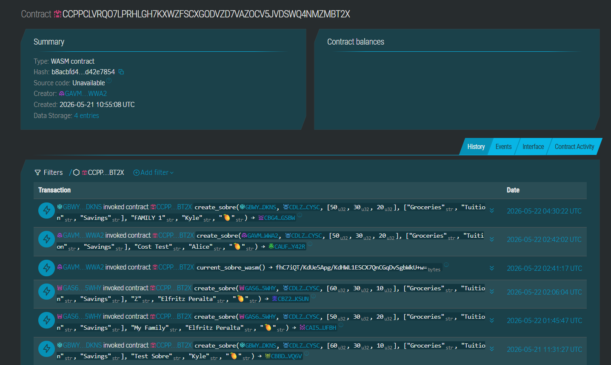
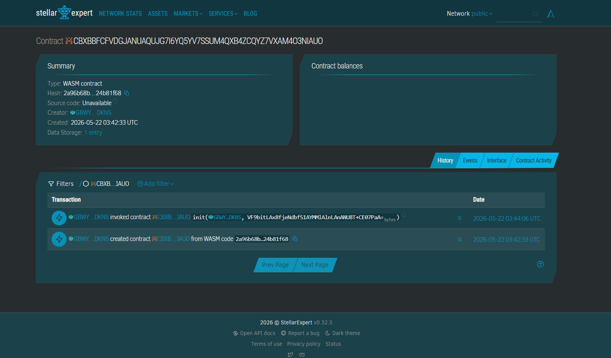

> ## 🏆 Winner — Best Use of Stellar
> **Build the Future of Finance Hackathon PH (2026)** · [Read the recap on BitDigest →](https://www.bitdigest.io/posts/filipino-builders-are-ready-the-build-the-future-of-finance-hackathon-proved-it)


---

# Sobre

> A joint account for families living worlds apart.

Sobre is a shared family wallet for OFW households, built on Stellar. Payment inflows arrive on chain and a Soroban contract atomically splits them across three named envelopes (e.g. Groceries, Tuition, Savings) by admin-set percentages. Both the OFW abroad and the family at home see the same balances update in real time, with the Savings envelope earning yield through Ondo's USDY (mocked on testnet) and an optional 48-hour-timelocked Grow bucket that supplies into Blend.

Currently building for the [Rise In × Stellar APAC Hackathon](https://www.risein.com/programs/build-on-stellar-philippines-hackathon), Philippines track. Demo day May 23, 2026, PDAX Office, Manila.

## 🧩 Problem

Philippine OFW households received a record $35.6 billion in remittances in 2025, equivalent to 7.3% of national GDP (BusinessWorld Online, 2026). Despite that scale, the money consistently fails to build lasting financial security at the receiving end.

Specifically:

- **96%** of remittances are consumed by food and basic household needs, leaving almost nothing for savings or goals (Inquirer News, 2023).
- **8 in 10** OFWs return home with no savings after years of working abroad (GMA News Online).
- **1 in 5** OFW-dependent families regularly runs out of money before the next remittance arrives, and **72%** of them respond by calling the OFW for more (Rappler, 2019).
- **25%** of remittances go directly to loan repayments, consuming the portion that should be building household assets (Ateneo de Manila University, 2020).
- Financial conversations between OFWs and their families are routinely avoided out of guilt, fear of conflict, and cultural pressure, which results in no shared plan and no accountability (CreditKaagapay, 2025).
- Guilt and distance drive OFWs to overspend on gifts, pasalubong, and unplanned requests, derailing whatever financial plan exists (AIA Philippines).

The money lands as a single lump sum into one bank account. No structure, no shared agreement, no real-time visibility. By the time anyone notices what was spent on what, the month is over.

## 🌟 Vision

Every Filipino household that depends on remittances has a clear, agreed-upon plan for the money before it arrives, and a shared real time view of what is actually happening with it. Savings becomes a default, not a discipline. The OFW earns less anxiety. The family at home earns less guesswork. Sobre is the on-chain primitive that makes that plan auditable and irreversible: percentages set once, deposits split atomically, balances visible to everyone in the household.

## 🎯 Purpose

We built Sobre because traditional financial tools treat the receiving family as a single anonymous account holder. The reality is that an OFW remittance is already a multi-stakeholder transaction the moment it lands. It is groceries for the spouse, school fees for the youngest, savings for next year. The "where did the money go" conversation is the symptom of a missing primitive: a wallet that natively understands an envelope budget.

Stellar's cheap, fast settlement plus Soroban's programmable money let us put that primitive on chain. The smart contract owns the split rule. No human has to remember to do the budgeting after the fact, and no spreadsheet has to be trusted by two people in two countries.

## 👥 Target Users

- **OFW remitters abroad** (Saudi, UAE, Hong Kong, Singapore, US) who want their money to be auto-budgeted at the source instead of disappearing into a single bank balance.
- **OFW-dependent households in the Philippines**, typically a spouse plus dependents, who want shared visibility into how the month's remittance has been split and spent.
- **Future:** unbanked and underbanked Filipinos with no formal savings tooling, plus MSMEs receiving cross-border B2B payments that need split-by-category accounting.

## ✨ Features

Below is what currently runs on the deployed testnet contract + the live web app. Everything is USDC-denominated on chain (the family's balance is real Circle-issued USDC on testnet); PHP and USD are display-only.

### Shared wallet
- **Admin + one member per family** (2-cap). Admin opens the wallet, shares a single-use invite link with the second admin. Each new admin picks their display name from Google OAuth on first connect.
- **Up to 4 supplementary accounts** (kids / dependents). Admin mints a separate sub-account invite that redeems into a tracked balance inside the same contract — sub-accounts don't share the envelope pool, they get top-ups from it.
- **Live dashboard.** Both admins poll `get_state` every 3 seconds via `simulateTransaction`. Total balance, per-envelope balances, member list, supplementary balances, Earn interest, and Grow position all stay in sync.

### Envelopes
- **Three named envelopes.** First two are admin-labeled (e.g. Groceries, Tuition); the third is permanently Savings. Icons customizable per envelope.
- **Admin-set percentage split.** Percentages sum to 100. Editable via a two-admin proposal flow if there's more than one admin — the second admin approves in-app before the change lands.
- **Envelope actions.** Tapping an envelope opens an action sheet with **Cash out to bank** (PDAX withdrawal to a registered InstaPay account) and, admin-only, **Send to family member** (top up a supplementary account from that envelope).

### Deposits (fiat → USDC → auto-split)
- **PDAX ramp.** In-app "Add money via PDAX" opens the checkout URL. User pays via InstaPay (any bank / e-wallet with QRPh). PDAX credits our institutional account, our server buys XLM on PDAX's exchange, then the contract's `deposit_from_xlm` swap-and-splits atomically: XLM → USDC via Soroswap, then USDC → envelopes by the family's percentage split, in one signed transaction. The user does not sign anything after the InstaPay payment.
- **PDAX bounds enforced:** ₱200 minimum, ₱49,999 maximum per deposit (below the InstaPay real-time cap + PDAX's Travel Rule threshold so no identity fields are required for the demo).

### Cash-out (USDC → PHP → bank)
- **Registered bank account.** Users add a bank once via the Profile tab (PDAX UAT supports Security Bank and CTBC in the demo). Bank info is one row per member; edits upsert.
- **Envelope-scoped cashout.** Users pick an envelope, enter an amount, and the contract's `withdraw` transfers USDC from that envelope to the caller's smart wallet. A follow-up SAC transfer forwards to the PDAX relay, which sells USDC → PHP and books an InstaPay payout to the bank on file. Usually lands in under a minute.
- **Supplementary cash-out.** Sub-account holders have their own dashboard and cash out from their tracked balance the same way.

### Savings + Earn (transparent yield through USDY)
- **One-click Earn.** Admin toggles Earn on. Every future deposit's Savings portion routes straight into USDY inside the same transaction; the existing Savings cache also migrates. No separate "supply" step, no manual staking.
- **On-read interest.** USDY's balance rebases on ledger time, so the interest ticks up between reads with no writes. The dashboard shows the current value, principal, and lifetime interest earned.
- **Transparent redeem.** When the family spends from Savings, the contract's `ensure_envelope_liquidity` helper redeems the shortfall from USDY inside the same tx via `withdraw` or `fund_subaccount`. No user-visible "unstake" wait — the family just sees Savings behave like a regular envelope, only with a growing balance.
- **On testnet we use MockUSDY**, a Rust contract that implements the exact same interface as [Ondo Finance USDY](https://ondo.finance/usdy) exposes on Stellar mainnet (`deposit`, `redeem`, `balance_of`, `underlying`). MockUSDY simulates 5% linear APY on ledger time. Real Ondo USDY is already live on Stellar mainnet — promotion is a single address swap on `earn_enable`.

### Savings + Grow (48-hour-timelocked lending on Blend)
- **Opt-in Grow bucket.** Admin can move a chosen amount out of Savings and into a Grow bucket that supplies into [Blend Protocol](https://www.blend.capital/)'s Testnet V2 XLM lending pool. Because Blend's testnet depth is on the XLM reserve (not USDC), the contract does a Soroswap sandwich internally: USDC → XLM → Blend supply on the way in, Blend withdraw → XLM → USDC on the way out. The Grow bucket is USDC-denominated end-to-end from the user's perspective.
- **48-hour timelock on withdrawals.** Any Grow withdrawal creates a persistent request that becomes executable 48 hours after the request lands. Requests are cancellable before unlock. This is a deliberate shared-wallet safeguard so a compromised admin can't drain the yield-earning bucket instantly.
- **Live b-rate accrual.** Blend's b-rate ticks the underlying value between reads. Dashboard shows locked amount + interest earned + available-to-request.

### Activity + safety
- **Live activity feed.** Every on-chain money movement (deposits, withdrawals, sub-account fundings, sub-account cashouts, member joins/removes, Earn supply/withdraw, Grow supply/request/execute) surfaces in a shared feed with day buckets and per-event detail modals.
- **In-flight PDAX deposit state** rendered inline (Awaiting InstaPay payment → Almost there → Sent to wallet). Users can safely close the deposit modal; the row re-appears in the activity feed and is re-hydratable.
- **Cash-out recovery.** If a cash-out signs the on-chain withdraw but the SAC transfer to the PDAX relay drops (wifi, refresh), the modal detects the half-completed state on next open and finishes the flow without double-debiting.
- **Sub-account lock.** Admin can freeze any supplementary account's spending instantly via `lock_subaccount` — the sub still exists on chain, but `withdraw_subaccount` panics with `SubAccountLocked` until unlocked.
- **One-shot invite links.** Every invite is a `sha256(plaintext)` hash stored on chain with a per-invite expiry. Once redeemed, the invite entry is removed from persistent storage — replay-resistant by construction. Admin can cancel unredeemed invites.

### Not yet built (roadmap)

- **Mainnet promotion of the v11 wasm** — blocked on two things: PDAX only granting UAT (testnet) access for the hackathon, and a security audit of the contract. Sobre will hold real family remittances on mainnet, so an independent audit is a hard prerequisite before any production deploy — no exceptions. Once PDAX issues production credentials and the audit is clean, the same wasm ships to mainnet with Circle mainnet USDC + real Ondo USDY at `earn_enable`.
- **Multi-token payment support.** The contract's `init(payment_token)` is token-agnostic; adding EURC or another SEP-41 asset is a factory-side deploy, not a code change.
- **MoneyGram Ramps.** Alternative off-ramp path documented in `docs/pdax-moneygram-integration.md`. Deferred until PDAX-side flows are polished.

## 🏗️ Architecture

Sobre spans a Soroban contract, a Next.js web app, a Supabase backend for PDAX transit-state tracking, and three on-chain third-party protocols (Circle USDC, Blend, Soroswap) plus one contract we wrote ourselves as a stand-in for Ondo (MockUSDY).

```
                ┌────────────────────────────────┐
       InstaPay │  User pays via bank / e-wallet │
   (BSP, QRPh)  └─────────────────┬──────────────┘
                                  ▼
                           ┌─────────────┐
                           │  PDAX UAT   │◀── /v1/fiat/deposit ──┐
                           │  API        │──── /v1/trade/quote ──┤
                           └──────┬──────┘                       │
                                  │ PDAX buys XLM                │
                                  ▼                              │
                           ┌─────────────┐                       │
                           │  Relay      │                       │
                           │  G-address  │                       │
                           └──────┬──────┘                       │
                                  │ signs deposit_from_xlm       │
                                  ▼                              │
┌────────────────────────────────────────────────────────────────┴──┐
│                     SobreContract (Soroban)                       │
│                                                                   │
│  deposit_from_xlm  → Soroswap XLM → USDC → split                  │
│  withdraw          → USDC to caller (auto-redeems from USDY)      │
│  fund_subaccount   → USDC envelope → sub balance                  │
│  earn_enable/*     → USDY position for Savings                    │
│  grow_enable/*     → USDC → XLM → Blend supply (48h timelock)     │
└─┬────────────┬────────────┬───────────────┬────────────────────┬──┘
  │            │            │               │                    │
  ▼            ▼            ▼               ▼                    ▼
Circle       Soroswap    MockUSDY         Blend Pool          User's
USDC SAC     Router      (Ondo USDY       (Testnet V2         Smart
                          stand-in)        XLM reserve)       Wallet
```

**Everything the family holds is USDC**, sitting either directly in the Sobre contract (envelope caches), or held on their behalf by MockUSDY (Savings Earn position), or held on their behalf by Blend as bTokens (Grow position). PHP and USD are UI-side display conversions using a fiat rate from a hook (`useTokenRate`).

## 🛠️ Tech Stack

- **Frontend:** Next.js 16 (App Router), React 19, TypeScript, Tailwind v4, shadcn/ui
- **Backend:** Supabase (Postgres + Realtime), Next.js API route handlers on Vercel
- **Blockchain:** Stellar (Soroban / Stellar SDK / passkey-kit smart wallets)
- **Other tools:** PDAX Institutional API (fiat ramp), Blend Protocol (yield), Soroswap (DEX), Circle USDC, Ondo USDY interface (MockUSDY on testnet)
- **Other tools:** Google OAuth via NextAuth, Stellar CLI 26.0, Vercel

Full detail below.

**Smart contracts** — Rust with `soroban-sdk` v25, compiled to `wasm32v1-none`. Four crates in `contract/`:
- `sobre` — per-family wallet contract (~60KB wasm, 27 exports)
- `sobre_factory` — deploys per-family instances via `deploy_v2`
- `sobre_launcher` — stateless wrapper chaining factory deploy + Grow + Earn enables behind one auth entry, so opening a Sobre is a single passkey prompt
- `mock_usdy` — Ondo USDY-shaped stand-in for testnet

**Blockchain** — Stellar Soroban (testnet + mainnet). Reads via `simulateTransaction`, writes via passkey-signed transactions, events via `getEvents`. `@stellar/stellar-sdk` v15.

**Web app** — Next.js 16 (App Router), React 19, TypeScript, Tailwind v4, shadcn/ui, in `web/`.

**Wallet** — [passkey-kit](https://github.com/kalepail/passkey-kit) v0.13. Users create a Stellar smart wallet with a WebAuthn passkey on first connect. No seed phrase, no browser extension, biometric signing on every write.

**Auth** — Google OAuth via NextAuth. The Google name seeds the member's display name on first connect.

**Backend** — Supabase Postgres for family metadata (percentages, member wallets, sub-account rows), the PDAX transit-state machine (`pdax_deposits`, `pdax_withdrawals`), and pending admin proposals (percent-split changes). Supabase Realtime pushes row changes to open dashboards.

**Third-party integrations:**
- **[PDAX Institutional API](https://pdax.ph/)** — fiat ↔ crypto ramp. Deposits via `POST /v1/fiat/deposit` (InstaPay checkout URL), withdrawals via `POST /v1/crypto/withdraw` + `POST /v1/fiat/withdraw`. UAT credentials for the hackathon; production API requires their institutional onboarding.
- **[Blend Protocol](https://www.blend.capital/) Testnet V2** — non-collateral lending pool for the Grow feature. We supply into the XLM reserve for b-rate yield.
- **[Soroswap](https://soroswap.finance/)** — DEX for USDC ↔ XLM swaps sandwiching the Blend supply/withdraw calls.
- **[Circle USDC](https://www.circle.com/en/usdc)** — real Circle-issued USDC on Stellar testnet, wrapped as a SAC.
- **[Ondo Finance USDY](https://ondo.finance/usdy)** — the production yield source for Savings, already live on Stellar mainnet. Testnet has no USDY deployment, so `contract/contracts/mock-usdy/` stands in with the exact interface real USDY exposes.

**Tooling** — Stellar CLI 26.0, Friendbot for testnet funding, Vercel for hosting.

## 🌐 Deployment

### Testnet (current)

- **Contract / App Address:** [`CAGQNXTXW422Q5RJP2AE3LZ3CGCSKPMUAWCPAVW6YGOPFDUU33TQFHAZ`](https://stellar.expert/explorer/testnet/contract/CAGQNXTXW422Q5RJP2AE3LZ3CGCSKPMUAWCPAVW6YGOPFDUU33TQFHAZ) (SobreFactory)

Current testnet deploy is the **v11 wasm** shipped 2026-07-14 (multi-admin on chain — the single `admin` slot became `admins: Vec<Address>`, and new methods `add_admin` / `remove_admin` handle promotion + demotion, with `remove_admin` refusing to leave the wallet with zero admins).

| Item | Value |
|---|---|
| **Network** | Testnet |
| **Passphrase** | `Test SDF Network ; September 2015` |
| **RPC** | `https://soroban-testnet.stellar.org` |

**Our contracts:**

| Contract | Address / Hash | Purpose |
|---|---|---|
| `SobreFactory` | [`CAGQNXTXW422Q5RJP2AE3LZ3CGCSKPMUAWCPAVW6YGOPFDUU33TQFHAZ`](https://stellar.expert/explorer/testnet/contract/CAGQNXTXW422Q5RJP2AE3LZ3CGCSKPMUAWCPAVW6YGOPFDUU33TQFHAZ) | Deploys per-family `SobreContract` instances |
| `SobreContract` wasm v11 | `1431c2848bd29fdb0b5d5ac698c968f882a3e3abec0352206afbf64772e57046` (63,704 bytes) | Per-family wallet — envelopes, Earn, Grow, sub-accounts, multi-admin |
| `MockUSDY` instance | [`CCHFSDJIBR2YCGCNQ4IRYPPOQXG562LKBHDRCJL5TWBAI3RZ5G6ZALHA`](https://stellar.expert/explorer/testnet/contract/CCHFSDJIBR2YCGCNQ4IRYPPOQXG562LKBHDRCJL5TWBAI3RZ5G6ZALHA) | Testnet stand-in for Ondo USDY. 5% simulated APY. Underlying = Circle testnet USDC |
| `MockUSDY` wasm | `9f543de035faaad0bc85f6071b1c8917aa8739e9ea69580876e0e140efaf81d6` (~20KB) | Same interface as Ondo's real USDY — mainnet promotion is a single address swap |

**Third-party contracts we call:**

| Contract | Address | Purpose |
|---|---|---|
| Circle testnet USDC SAC | [`CBIELTK6YBZJU5UP2WWQEUCYKLPU6AUNZ2BQ4WWFEIE3USCIHMXQDAMA`](https://stellar.expert/explorer/testnet/contract/CBIELTK6YBZJU5UP2WWQEUCYKLPU6AUNZ2BQ4WWFEIE3USCIHMXQDAMA) | Payment token. Real Circle-issued USDC, issuer `GBBD47IF…` |
| XLM native SAC | [`CDLZFC3SYJYDZT7K67VZ75HPJVIEUVNIXF47ZG2FB2RMQQVU2HHGCYSC`](https://stellar.expert/explorer/testnet/contract/CDLZFC3SYJYDZT7K67VZ75HPJVIEUVNIXF47ZG2FB2RMQQVU2HHGCYSC) | Intermediate hop for deposit ramp + Grow leg |
| Blend Pool (Testnet V2) | [`CCEBVDYM32YNYCVNRXQKDFFPISJJCV557CDZEIRBEE4NCV4KHPQ44HGF`](https://stellar.expert/explorer/testnet/contract/CCEBVDYM32YNYCVNRXQKDFFPISJJCV557CDZEIRBEE4NCV4KHPQ44HGF) | Grow supplies here, reserve index 0 (XLM) |
| Soroswap Router | [`CCJUD55AG6W5HAI5LRVNKAE5WDP5XGZBUDS5WNTIVDU7O264UZZE7BRD`](https://stellar.expert/explorer/testnet/contract/CCJUD55AG6W5HAI5LRVNKAE5WDP5XGZBUDS5WNTIVDU7O264UZZE7BRD) | USDC ↔ XLM swaps for deposit ramp + Grow sandwich |

**How to verify the Earn position is real:** open MockUSDY's contract page on stellar.expert. Its `Contract balances` tab shows the total USDC MockUSDY holds across all depositors (the collateral backing every USDY position). The `Events` tab logs every `deposit(from, amount)` and `redeem(from, amount)`; filter by any `SobreContract` address to see just that family's supplies. The `Interface` tab lets you call `balance_of(owner)` right in the browser — pass a family's `SobreContract` address to get their current USDY position in USDC stroops. This is the same query the frontend uses.

**SobreContract exports (v11):**

- **Lifecycle:** `init`, `close_wallet`, `upgrade`
- **Admins:** `add_admin`, `remove_admin`
- **Members:** `create_invite`, `cancel_invite`, `join_wallet`, `remove_member`
- **Sub-accounts:** `create_subaccount_invite`, `cancel_subaccount_invite`, `join_as_subaccount`, `fund_subaccount`, `lock_subaccount`, `unlock_subaccount`, `withdraw_subaccount`
- **Money movement:** `deposit_with_split`, `deposit_from_xlm`, `withdraw`
- **Earn (USDY):** `earn_enable`, `earn_supply`, `earn_withdraw`
- **Grow (Blend + Soroswap):** `grow_enable`, `grow_transfer_from_savings`, `request_grow_withdrawal`, `execute_grow_withdrawal`, `cancel_grow_withdrawal`
- **Read:** `get_state`

**SobreFactory exports:** `init`, `set_sobre_wasm`, `current_sobre_wasm`, `create_sobre`, `sobres_of_admin`.

**Upgrade model:** the factory stores the canonical SobreContract wasm hash. Admin can call `set_sobre_wasm(new_hash)` to swap which wasm new families deploy with. Each existing Sobre stores the factory address and can opt into the latest hash via its own admin-only `upgrade()`, which calls Soroban's `update_current_contract_wasm` in place. Same contract address, same storage, new code.

📸 **Screenshot — Stellar Expert (Testnet):**



[View live on stellar.expert →](https://stellar.expert/explorer/testnet/contract/CAGQNXTXW422Q5RJP2AE3LZ3CGCSKPMUAWCPAVW6YGOPFDUU33TQFHAZ)

### Mainnet (previous hackathon deploy — pre-v11)

- **Contract / App Address:** [`CBXBBFCFVDGJANUAQUJG7I6YQ5YV7SSUM4QXB4ZCQYZ7VXAM4O3NIAUO`](https://stellar.expert/explorer/public/contract/CBXBBFCFVDGJANUAQUJG7I6YQ5YV7SSUM4QXB4ZCQYZ7VXAM4O3NIAUO) (SobreFactory)

The mainnet deploy below is from the earlier Build the Future of Finance Hackathon PH (2026) and does **not** include Earn, Grow, PDAX, sub-accounts, or multi-admin. The APAC-track v11 wasm is testnet-only for this hackathon because PDAX granted us UAT (testnet) access only — production PDAX credentials are the gate for a fresh mainnet promotion.

| | |
|---|---|
| **SobreFactory** | `CBXBBFCFVDGJANUAQUJG7I6YQ5YV7SSUM4QXB4ZCQYZ7VXAM4O3NIAUO` |
| **SobreContract wasm hash** | `545f5b8ad2c0c7c7e378d75b7d2d4060c3250259cb02700d53c4fe084d3b3da0` |
| **Payment token** | XLM native SAC `CAS3J7GYLGXMF6TDJBBYYSE3HQ6BBSMLNUQ34T6TZMYMW2EVH34XOWMA` |
| **Passphrase** | `Public Global Stellar Network ; September 2015` |
| **RPC** | `https://mainnet.sorobanrpc.com` |
| **Factory explorer** | [stellar.expert](https://stellar.expert/explorer/public/contract/CBXBBFCFVDGJANUAQUJG7I6YQ5YV7SSUM4QXB4ZCQYZ7VXAM4O3NIAUO) |

📸 **Screenshot — Stellar Expert (Mainnet):**



## 🚀 How to Run Locally

```bash
git clone https://github.com/laughable-9/sobre.git
cd sobre

# Web app (one terminal)
cd web
npm install
npm run dev          # http://localhost:3000

# Contract tests (another terminal, from repo root)
cd contract
cargo test           # 88 tests, ~1 second
```

The web app talks to the live testnet factory by default, so once `npm run dev` is up you can open `http://localhost:3000`, sign in with Google, and either open a new Sobre or paste an invite link. The passkey-kit smart wallet is created on first connect using a WebAuthn passkey (biometric or platform-authenticator).

You'll need Supabase credentials in `web/.env.local` for the family metadata + PDAX transit tables — see `web/.env.example` for the shape.

## 🎥 Demo

- 🔗 **Live App:** [sobre-mocha.vercel.app](https://sobre-mocha.vercel.app) (testnet)
- 🎬 **Demo Video:** in progress for APAC demo day
- 🖼️ **Pitch Deck:** in progress

## 👨‍💻 Team

**Team Legends**, UP Baguio 🦅

| Name | Role | GitHub |
|---|---|---|
| Clarence Kyle Pagunsan | Co-founder, lead developer (contract + frontend) | [@laughable-9](https://github.com/laughable-9) |
| Elfritz Angelo Peralta | Co-founder, product manager & business dev | [@elfrtz](https://github.com/elfrtz) |
| Lance Gabriel Sacdalan | Co-founder, QA | [@sacdalance](https://github.com/sacdalance) |

## 📜 License

MIT. See [`LICENSE`](./LICENSE).

## 📚 References

- AIA Philippines. (n.d.). *Financial guide for OFWs to protect your family's future.* https://www.aia.com.ph/en/about-us/aia-ph-blog/protection/financial-guide-for-ofws
- Ateneo de Manila University. (2020). *Overseas remittances: Saving the 'resilient' owners* (Policy Brief No. 2020-16). https://www.ateneo.edu/sites/default/files/2022-06/Policy%20Brief%202020-16.pdf
- BusinessWorld Online. (2026, February 17). *OFW remittances hit record $35.6B.* https://www.bworldonline.com/top-stories/2026/02/17/730931/ofw-remittances-hit-record-35-6b/
- CreditKaagapay. (2025, September 5). *Sacrifice and survival: Tackling family pressure and rising costs as a Filipino OFW.* https://www.creditkaagapay.com/2025/09/05/sacrifice-and-survival-tackling-family-pressure-and-rising-costs-as-a-filipino-ofw/
- GMA News Online. (n.d.). *8 money mistakes why OFWs are struggling financially.* https://www.gmanetwork.com/news/pinoyabroad/dispatch/609617/8-money-mistakes-why-ofws-are-struggling-financially/story/
- Inquirer News. (2023). *BSP data: OFW remittances go to food, basic needs.* Philippine Daily Inquirer. https://newsinfo.inquirer.net/2153866/bsp-data-ofw-remittances-go-to-food-basic-needs
- Rappler. (2019). *OFW remittances hit all-time high, but families still run out of cash, study.* https://www.rappler.com/business/247315-uniteller-study-ofw-remittances-hit-all-time-high-families-still-run-out-cash/

---

## Appendix: deploying your own factory

```bash
cd contract
stellar contract build

# 1. Upload the SobreContract wasm. Capture the hash from the output.
stellar contract upload \
  --wasm target/wasm32v1-none/release/sobre.wasm \
  --source alice \
  --rpc-url https://soroban-testnet.stellar.org \
  --network-passphrase "Test SDF Network ; September 2015"

# 2. Deploy a fresh SobreFactory and init it with the wasm hash.
stellar contract deploy \
  --wasm target/wasm32v1-none/release/sobre_factory.wasm \
  --source alice \
  --rpc-url https://soroban-testnet.stellar.org \
  --network-passphrase "Test SDF Network ; September 2015" \
  --alias sobre_factory

stellar contract invoke \
  --id sobre_factory --source alice \
  --rpc-url https://soroban-testnet.stellar.org \
  --network-passphrase "Test SDF Network ; September 2015" \
  -- init --admin alice --sobre_wasm <hash_from_step_1>

# 3. Open a Sobre via the factory (admin becomes the caller). Payment
#    token is Circle testnet USDC; envelope names + split live in
#    Supabase, not on chain, so no --percents / --envelope_names args.
stellar contract invoke \
  --id sobre_factory --source alice \
  --rpc-url https://soroban-testnet.stellar.org \
  --network-passphrase "Test SDF Network ; September 2015" \
  -- create_sobre \
  --admin alice \
  --payment_token CBIELTK6YBZJU5UP2WWQEUCYKLPU6AUNZ2BQ4WWFEIE3USCIHMXQDAMA
```

```bash
# 4. Deploy the SobreLauncher (stateless, no init). The web app creates
#    Sobres through it — one transaction bundles the factory deploy plus
#    the Grow/Earn enables behind a single passkey prompt.
stellar contract deploy \
  --wasm target/wasm32v1-none/release/sobre_launcher.wasm \
  --source alice \
  --rpc-url https://soroban-testnet.stellar.org \
  --network-passphrase "Test SDF Network ; September 2015" \
  --alias sobre_launcher
```

To point the web app at your own deployment, update `FACTORY_CONTRACT_ID` and `LAUNCHER_CONTRACT_ID` in `web/src/lib/config.ts`.

**CLI gotcha:** the stellar-cli's built-in `--network testnet` alias points at a dead RPC. Always pass explicit `--rpc-url` and `--network-passphrase` (or set them as env vars).
